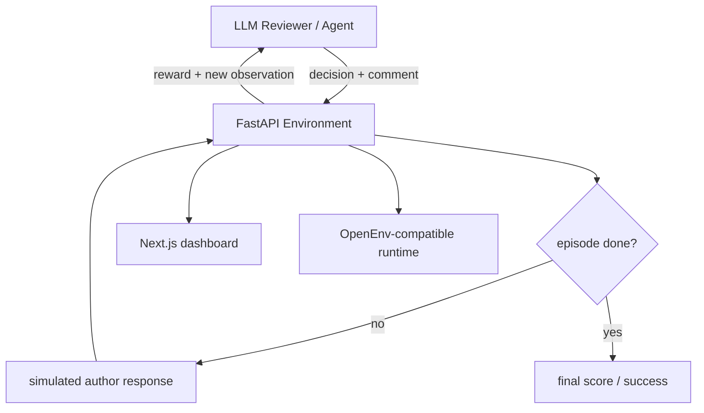

# PR Review Negotiation Environment

[](https://github.com/openenv/core)
[](https://opensource.org/licenses/MIT)
[](https://fastapi.tiangolo.com/)
[](https://nextjs.org/)

PR Review Negotiation Environment is a reinforcement learning benchmark for advanced software engineering judgment. Instead of grading a single bug report, it evaluates whether an agent can review a pull request like a strong senior engineer: identify the root cause, resist partial or misleading fixes, and escalate when the risk is truly severe.

The environment includes a FastAPI backend, a live Next.js dashboard, OpenEnv-compatible schemas, and an inference entry point for running external models through the benchmark loop.

## Why this benchmark exists

Most code-review benchmarks flatten engineering judgment into a single turn:

- Find the bug.
- Name the category.
- Move on.

Real review work is harder. Reviewers have to reason about intent, implementation, partial fixes, and severity across multiple turns. This environment focuses on that gap.

It is designed to measure whether an agent can:

- explain the underlying flaw instead of just pointing at a bad line
- stay firm when an author proposes a cosmetic or incomplete fix
- escalate immediately for critical security failures
- operate through a structured environment that can be validated and benchmarked automatically

## Evaluation tasks

The default task suite contains four scenarios:

| Task | Goal | What it tests |
| --- | --- | --- |
| `single-pass-review` | Catch an off-by-one pagination bug | Root-cause depth in one turn |
| `iterative-negotiation` | Reject a fake SQL injection fix | Persistence across negotiation |
| `escalation-judgment` | Escalate a hardcoded JWT secret | Severity and escalation judgment |
| `custom-review` | Review user-provided code or diffs | Live manual testing through the dashboard |

## System overview



## What is included

- `server/app.py`: FastAPI runtime and OpenEnv-facing endpoints
- `server/environment.py`: episode state machine and task transitions
- `server/graders.py`: step and final reward logic
- `server/action_normalizer.py`: tolerant parsing for model outputs that are close to JSON but not perfect
- `inference.py`: model runner for OpenAI-compatible APIs
- `pr_review_dashboard/`: live dashboard for benchmark scenarios and custom review sessions
- `openenv.yaml`: benchmark metadata for OpenEnv tooling

## Dashboard highlights

The dashboard is not just a mockup anymore. It is wired to the live backend and supports both benchmark runs and custom review sessions.

Current workflow:

1. Choose a scenario or use `Custom Review Session`
2. Configure the reviewer model and credentials
3. Load the benchmark session or open the custom workspace
4. Run the review
5. For custom review, accept or copy the suggested fix when available

Custom review mode keeps the editor visible while feedback updates, so you can iterate on your own code without being kicked back into a benchmark diff.

## Quick start

### Local Python setup

```bash
pip install -r requirements.txt
```

### Start on Linux or macOS

```bash
./start.sh
```

### Start on Windows

```powershell
.\start_local.ps1
```

The Windows launcher automatically picks free backend and frontend ports, starts both services, and prints the dashboard URL.

## Run services manually

### Backend

```bash
python -m uvicorn server.app:app --host 0.0.0.0 --port 8000
```

### Dashboard

```bash
cd pr_review_dashboard
npm install
ENV_BASE_URL=http://127.0.0.1:8000 npm run dev
```

## Docker

```bash
docker build -t pr-review-env .
docker run -p 7860:7860 pr-review-env
```

The container exposes the integrated app through the reverse proxy on port `7860`.

## API surface

The backend exposes the endpoints needed for interactive use and automated evaluation:

- `GET /health`
- `GET /metadata`
- `GET /schema`
- `GET /tasks`
- `POST /reset`
- `POST /step`
- `GET /state`
- `POST /config/custom`
- `POST /diff`

The `/step` path includes action normalization so agents that return fenced JSON or light surrounding prose do not immediately fail with `422`-style formatting problems.

## OpenEnv compatibility

This project ships with an OpenEnv-compatible runtime description in `openenv.yaml`. The current benchmark metadata includes:

- runtime: FastAPI
- task registry for all four scenarios
- schema-driven action, observation, and state models

Example validation command:

```bash
openenv validate --url http://127.0.0.1:8000
```

## Inference

Use `inference.py` to run an external model against the benchmark through an OpenAI-compatible API.

Typical use cases:

- testing a hosted model before leaderboard submission
- comparing behavior across providers
- reproducing a failure from the dashboard in a scripted loop

## Repository structure

```text
.
|- server/
|  |- app.py
|  |- environment.py
|  |- graders.py
|  |- action_normalizer.py
|  `- tasks/
|- pr_review_dashboard/
|- inference.py
|- models.py
|- openenv.yaml
|- start.sh
`- start_local.ps1
```

## Design principles

This benchmark is intentionally opinionated:

- Root cause beats surface description.
- A partial fix should still fail.
- Critical security issues should escalate, not just request changes.
- The dashboard should reflect live environment state, not a hardcoded demo.

## Development notes

- Root benchmark logic lives in the backend, not the dashboard.
- Custom review is intended for manual experiments and demo workflows.
- The dashboard uses a Next.js proxy layer so it can discover the active backend port at runtime.

Additional implementation notes and lessons learned live in `LEARNINGS.md`.

## License

MIT License.
