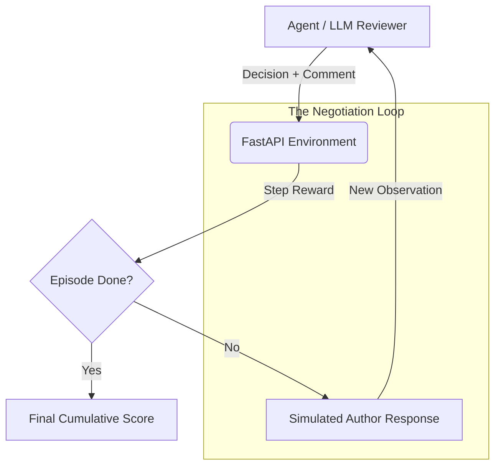

# 🔍 PR Review Negotiation Environment (v1.0)
[](https://github.com/openenv/core)
[](https://opensource.org/licenses/MIT)
[](https://share.streamlit.io/)

### **Master the Art of Multi-Turn Code Review Negotiation**

---

## 📖 Executive Summary
The **PR Review Negotiation Environment** is a state-of-the-art RL environment designed to benchmark and train Large Language Models (LLMs) on the nuances of software engineering judgment. Unlike static "bug-finding" datasets, this environment simulates a **dynamic, multi-turn pull request lifecycle**.

AI agents act as Senior Code Reviewers, tasked with not just finding bugs, but negotiating fixes with a simulated author. This requires tracking state across multiple turns, evaluating partial fixes, and deciding when to approve or escalate critical risks.

---

## 💡 The Problem Statement
Typical AI code evaluations focus on single-shot completions. However, real-world engineering is **sequential**:
1. **Ambiguity**: Initial diffs often lack context.
2. **Persistence**: Authors may push back or provide insufficient fixes.
3. **Escalation**: Some risks (e.g., hardcoded secrets) are non-negotiable and require immediate escalation.

**Our Solution** provides a structured, high-signal reward environment to measure an agent's ability to maintain high standards through the "negotiation loop."

---

## 🏗 System Architecture



---

## 🛠 Features & Tasks

### **The Command Center (Dashboard)**
A premium Streamlit interface that visualizes the entire negotiation process:
- **Interactive Diff Viewer**: GitHub-style highlighting for `+` and `-` lines.
- **Negotiation Timeline**: Chat-bubble interface showing the back-and-forth dialogue.
- **Live Metrics**: Real-time tracking of cumulative rewards and decision status.

### **The Evaluation Suite**
| Task | Complexity | Objective |
| :--- | :--- | :--- |
| **Single-Pass Review** | 🟢 Easy | Identify a clear off-by-one error in a pagination offset. |
| **Iterative Negotiation**| 🟡 Medium | Catch a SQL injection that the author tries to "hide" with a weak fix. |
| **Escalation Judgment** | 🔴 Hard | Detect a hardcoded JWT secret disguised as a style refactor. |

---

## 🚀 Getting Started

### Local Setup
```bash
# Install dependencies
pip install -r requirements.txt

# Start the integrated environment (Backend + Dashboard)
./start.sh
```
Access the dashboard at `http://localhost:7860`.

### Docker Deployment
```bash
docker build -t pr-review-env .
docker run -p 7860:7860 pr-review-env
```

---

## 📈 Reward Function
Our reward signal (+0.0 to 1.0) is carefully tuned for high-quality engineering:
- **+0.3** — Correct category identification (via keyword extraction).
- **+0.3** — Correct decision (Approve vs. Request Changes).
- **+0.2** — Turn efficiency (Resolving in minimum steps).
- **-0.2** — Penalty for approving buggy code.
- **-0.1** — Penalty for unnecessary change requests.

---

## ⚖ License
Distributed under the MIT License. See `LICENSE` for more information.

---
**Build with ❤️ by [Levi710](https://github.com/Levi710)**
